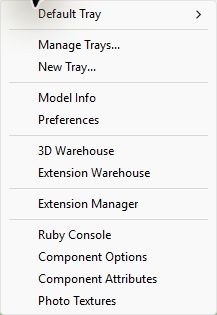
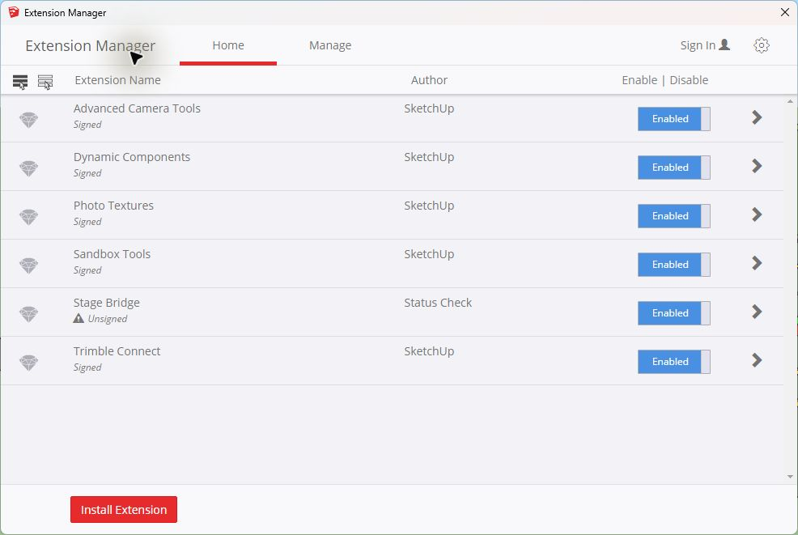

# Install and Test Stage Bridge Beta 6

This guide is for SketchUp Make 2017 on Windows. Stage Bridge does not work in SketchUp Free for Web.

## Download

1. Open the latest prerelease on the official `statuscheckgg/stage-bridge` GitHub repository.
2. Under **Assets**, download `stage-bridge-0.1.0-beta.6.rbz`.
3. Leave the file as `.rbz`; do not unzip it.
4. Keep your original Practisim `.STG` file unchanged. Test with a copy.

## Install in SketchUp Make 2017

1. Open SketchUp Make 2017.
2. Click **Window**, then **Extension Manager**.

3. Click the red **Install Extension** button.

4. Find the downloaded `stage-bridge-0.1.0-beta.6.rbz`, select it, and click **Open**.
5. Approve the warning only when the RBZ came from the official GitHub prerelease.
6. Restart SketchUp if it asks you to.
7. Reopen **Window > Extension Manager** and confirm **Stage Bridge** says **Enabled**.

This beta is unsigned. If SketchUp refuses to load it, open the gear icon in Extension Manager and select the `Unrestricted` loading policy for this local test. Restore your preferred policy after testing.

## Import an STG Stage

1. Start a new SketchUp model.
2. Click **File > Import**.
3. Set the file type to **Practisim Stage (*.STG)**.
4. Select your copied STG file and click **Import**.
5. SketchUp should zoom to the stage. The stock human figure is removed automatically.

You can also use **Extensions > Stage Bridge > Import Practisim Stage**. Stage Bridge remembers the last folder you successfully imported from.

## Move the Props

1. Double-click the outer `Stage Bridge - <stage name>` group once.
2. Single-click a target, wall, barrel, popper, or fault line.
3. Use SketchUp's normal **Move**, **Rotate**, **Scale**, **Copy**, and **Delete** tools.
4. Use **Extensions > Stage Bridge > Add Practisim Prop** to add a mapped prop.

Do not explode a prop or edit its internal faces. Keep props upright; do not mirror, shear, pitch, or roll them.

## What to Check in Beta 6

- The stock SketchUp human is gone.
- Full-size steel poppers match the leftmost popper from the Big Prop row, with the black mechanism facing the same fall direction as Practisim.
- White-center vertical stacks use the selected no-shoot assembly; the white band is between the scoring targets and does not cover the upper headbox.
- Black hard-cover vertical stacks use the same assembly with a black center.
- Swingers use the complete Big Prop stand, pivot arms, counterweight, and paper target instead of the earlier simplified brown target.
- Walls, targets, barrels, and fault lines are upright, grounded, and in familiar positions.
- **Validate Stage** and **Export Practisim Stage** are grayed out. That is intentional for this import-and-edit MVP.

Saving the SketchUp model creates an `.skp` review file only. This beta cannot save a Practisim-readable STG.

## Report a Problem

Open a GitHub Issue and include the Stage Bridge version, SketchUp Make version, the STG prop name if known, and before/after screenshots. Do not upload a private match stage unless you intend to share it publicly.
